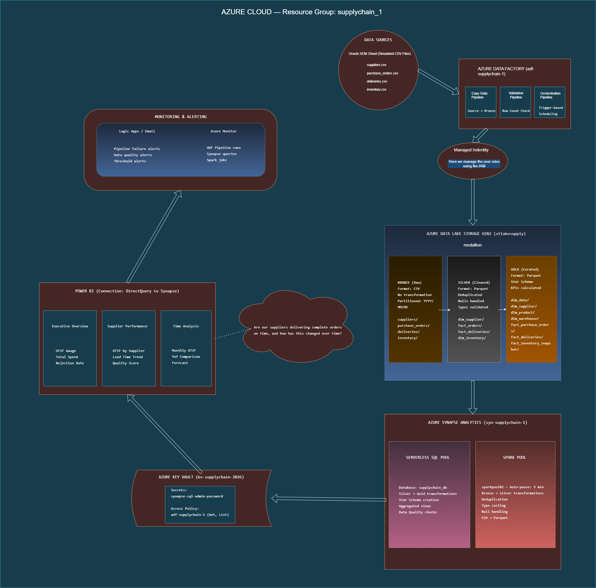
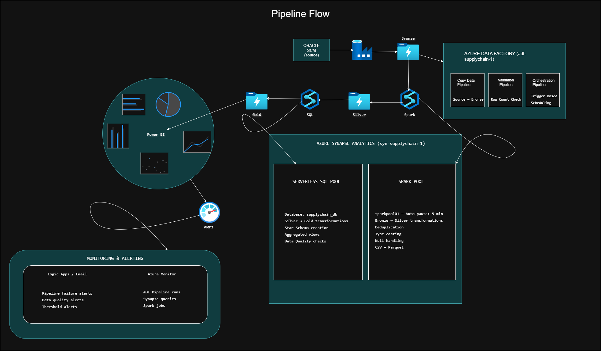
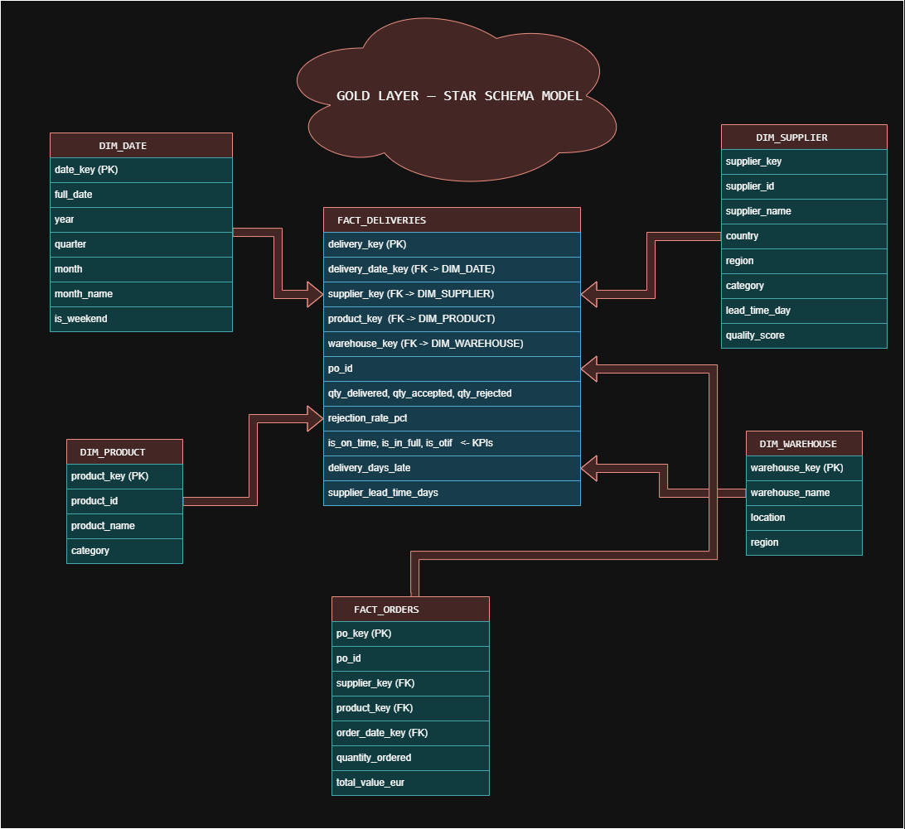

# Azure_Cloud
In this project we will try to work on DataLake using Azure Synapse and Power BI.

## 🤝 Contributors

| Avatar | Contributor |
| :---: | :--- |
|  | **Yassir Tagemouati** [@yassir](https://github.com/TageYassir) |

# 🚀 EPIC 1 – Azure Infrastructure & Security

## Modern Data Warehouse – Supply Chain & Logistics Analytics

This repository contains the implementation of **Epic 1** of the **Modern Data Warehouse** project.

The objective of this phase is to provision a secure Azure cloud environment following the **Medallion Architecture (Bronze → Silver → Gold)** while applying Azure security best practices.

---

## 📋 Project Overview

The infrastructure is built entirely on Microsoft Azure and includes:

- Azure Data Lake Storage Gen2 (ADLS Gen2)
- Azure Data Factory (ADF)
- Azure Synapse Analytics
- Azure Key Vault
- Apache Spark Pool

The environment is designed to support a scalable data platform for Supply Chain & Logistics Analytics.

---

# 🏛️ Solution Architecture

  

<b>Figure 1.</b> Overall Azure architecture implementing the Medallion Data Lake (Bronze → Silver → Gold).

---

## ☁️ Azure Resources

| Resource | Name | Region | Configuration |
|----------|------|--------|---------------|
| Azure Data Lake Storage Gen2 | `stlakesupply` | West Europe | Hierarchical Namespace enabled, Cool Tier, LRS |
| Azure Data Factory V2 | `adf-supplychain-1` | West Europe | System-Assigned Managed Identity |
| Azure Synapse Analytics | `syn-supplychain-1` | France Central* | Serverless SQL + Spark |
| Azure Key Vault | `kv-supplychain-2026` | West Europe | Standard Tier, Soft Delete enabled |
| Spark Pool | `sparkpool01` | France Central* | Small (4 vCPUs, 32 GB RAM), Autoscale (3–10 nodes), Auto Pause (5 minutes), Spark 3.4 |

> **Note:** Synapse was deployed in **France Central** because of a temporary capacity limitation in **West Europe** for Azure Student subscriptions.

---

# 🏗️ Medallion Architecture

stlakesupply
│
└── medallion
    ├── bronze
    │   └── Raw CSV / JSON
    │
    ├── silver
    │   └── Cleaned Delta / Parquet
    │
    └── gold
        └── Star Schema

### Bronze

- Raw source data
- Immutable storage
- Landing zone

### Silver

- Data cleansing
- Data validation
- Standardization
- Delta / Parquet format

### Gold

- Business-ready datasets
- Star Schema
- Analytics & Reporting

---

# 🔄 Data Pipeline Flow

  

<b>Figure 2.</b> End-to-end data ingestion and orchestration workflow using Azure Data Factory and Azure Synapse Analytics.

---

## 🔗 Azure Data Factory Linked Services

| Linked Service | Target | Authentication | Status |
|----------------|--------|----------------|--------|
| `ls_adls_supplychain` | Azure Data Lake Storage Gen2 | Managed Identity | ✅ Connected |
| `ls_keyvault_supplychain` | Azure Key Vault | Managed Identity | ✅ Connected |
| `ls_synapse_supplychain` | Synapse Serverless SQL | Managed Identity | ✅ Connected |

---

# 🔒 Security

The platform follows the **Principle of Least Privilege**.

### RBAC

| Resource | Role | Identity |
|----------|------|----------|
| ADLS Gen2 | Storage Blob Data Contributor | ADF Managed Identity |
| ADLS Gen2 | Storage Blob Data Contributor | Synapse Managed Identity |
| Synapse Workspace | Synapse Contributor | ADF Managed Identity |
| SQL Database | db_owner | ADF Managed Identity |

### Azure Key Vault

| Secret | Description |
|---------|-------------|
| `synapse-sql-admin-password` | Synapse SQL Administrator Password |

### Security Best Practices

- ✅ Managed Identities only
- ✅ No hardcoded credentials
- ✅ Secrets stored in Azure Key Vault
- ✅ Least Privilege RBAC
- ✅ Storage Contributor instead of Owner
- ✅ Key Vault permissions limited to **Get** and **List**

---

# 🗄️ Synapse SQL

| Setting | Value |
|----------|-------|
| Database | `supplychain_db` |
| ADF User | `[adf-supplychain-1]` (External Provider) |
| Role | `db_owner` |
| Endpoint | `syn-supplychain-1-ondemand.sql.azuresynapse.net` |
| Firewall | Azure Services + AllowAll |

---

# ⭐ Gold Layer Star Schema

  

<b>Figure 3.</b> Business-oriented dimensional model (Star Schema) used for analytics and Power BI reporting.

---

# ✅ Acceptance Criteria

## User Story 1.1

- ✅ Azure resources deployed
- ✅ Medallion architecture created
- ✅ Managed Identities enabled
- ✅ Storage configured

## User Story 1.2

- ✅ Key Vault configured
- ✅ Secrets stored securely
- ✅ Managed Identity authentication
- ✅ RBAC configured
- ✅ Least Privilege applied

---

# 💰 Estimated Daily Cost

| Resource | Cost |
|----------|------|
| ADLS Gen2 | ~€0.01/day |
| Azure Data Factory | €0 |
| Synapse Serverless SQL | €0 |
| Spark Pool | €0 (Auto Pause) |
| Azure Key Vault | ~€0.03/day |

**Total:** **< €0.05/day**

---

# 🛠️ Technologies

- Microsoft Azure
- Azure Data Lake Storage Gen2
- Azure Data Factory
- Azure Synapse Analytics
- Azure Key Vault
- Apache Spark
- Serverless SQL
- Delta Lake
- Managed Identity
- RBAC

---

# 👨‍💻 Author

**Yassir Tagemouati**

Engineering Cycle – Big Data

Euromed School of Digital Engineering & Artificial Intelligence (EIDIA)

---

# 📌 Status

## ✅ Epic 1 Completed (100%)

Infrastructure, security, storage, authentication, and core Azure services have been successfully deployed and validated.

The platform is now ready for **Epic 2 – Data Ingestion & Orchestration**.
